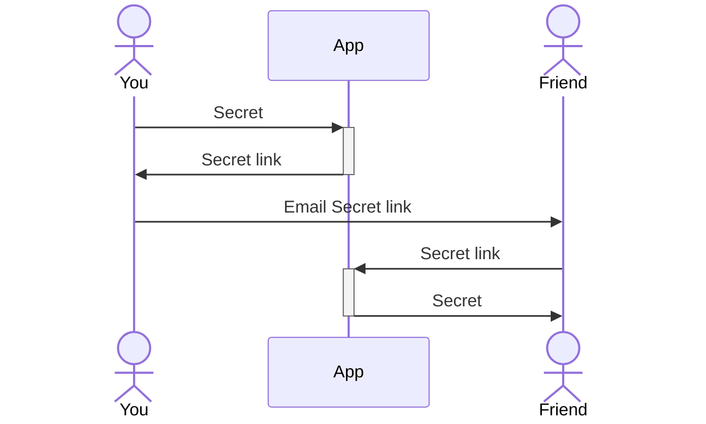
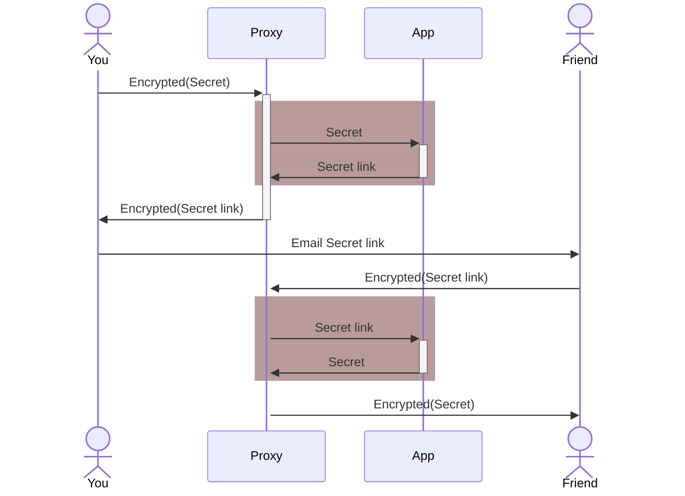

# Secret app
The secret app is made to exchange secrets.

The repo contains code, test and docker file

Status:
* [](https://github.com/buildcomplete/YT-secrets/actions/workflows/test-secret-sharing.yml)
* [](https://github.com/buildcomplete/YT-secrets/actions/workflows/deploy-secret-sharing.yml)

## Run using Docker
Or instead of the manual setup, build and run the docker image with the following commands
```sh
docker build -t yt-secrets .
docker run -v [absolute-path-to-app]:/App yt-secrets
```

### To start the app manually (From docker)
```sh
docker run -it -p 80:80 -v [absolute-path-to-app]:/App yt-secrets sh
flask --app SecretController  run -h 0.0.0.0 -p 80
```

### To test the application after building the docker image
```sh
docker run -v /var/www/secret_app/app:/App test-secret -rm pytest
```

## Configure automation
The following steps should be automated
* Testing the code on deploy
* Deploy the code to production (For missing critical application the code should first be deployed to a staging server and tested, I will not describe that)

### Manual Deployment to a server
Before doing any automation, I will test all the steps manually, the provisioning (start up) of the server will not be automated.
1) Configure a server where we can run the application, I will use Digital Ocean [](https://www.digitalocean.com/?refcode=dcd9cffbef59&utm_campaign=Referral_Invite&utm_medium=Referral_Program&utm_source=badge)
   * Spin-up server✔
   * Create a certificate for secure access✔
   * Configure Firewall✔
   * Install docker✔ and docker-compose✔
2) Push the application to the server (using rsync)✔
3) Start the application using docker-compose✔
   * Create a docker-compose file that mounts the volumes✔
   * Start the application as a service
4) Update application to use a proper server ([Gunicorn](https://gunicorn.org/))✔ (notice the warning when starting using flask development server) 


### Automatic deployment 
1) Setup github action to run test
2) Setup github action to deploy to production
   * Convert private key to not use a password
   * Install private key in github secrets
   * push using github (Stop the application before push and restart?)

## Enabling Encryption of communication
Without encrypted communication, people can read all the data send, since we are sharing secrets, we obviously want to make sure they stay secret.


With encryption, the communication becomes impossible to read, so the secret can stay safe, I enable encryption using nginx and certbot, this installs a proxy that enforces encrypted communication on the internet


Change port on docker application to 5000

docker-compose.yml
```docker 
    ports:
      - "5000:5000"
```
Install nginx

setup proxy to application
* Enable proxy pass of domain name
* Update werkzeug so it handle proxy stuff correctly
Install certbot and enable to encrypt the communication